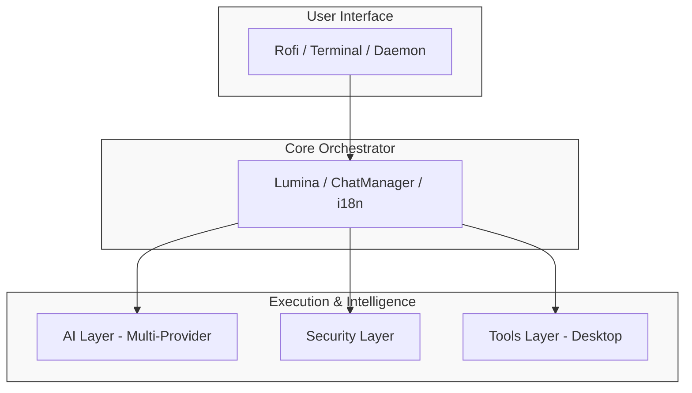

<p align="center">
    
</p>
<h1 align="center">DeskLumina</h1>

<p align="center">
  <strong>Intelligent Desktop Automation for Linux</strong><br>
  <em>Natural Language Control • High Performance • Secure by Design</em>
</p>

<p align="center">
  
  
  
  
</p>

---

## 📌 Overview

DeskLumina automates your Linux desktop using Bun and TypeScript. It translates human intent into system execution, letting you control your environment through natural language.

By leveraging a multi-provider AI layer (Groq, OpenAI, Anthropic, Gemini, OpenRouter, Hugging Face) for near-instant inference and Rofi for a lightweight UI, DeskLumina provides a seamless, keyboard-centric experience for launching apps, managing files, and controlling media.

---

## 🚀 Key Features

- 🪟 **Rofi Integration**: A lightweight, keyboard-friendly UI that fits perfectly into tiling window managers like i3, bspwm, or sway.
- 🔊 **Low-Latency TTS**: Near-instant voice responses using the `AdaptiveChunker` and Edge TTS.
- 🤖 **Smart Daemon**: A persistent background service that eliminates startup overhead.
- 🛡️ **Security Layer**: Automatic detection of dangerous commands with interactive confirmation.
- 🔧 **Extensible Tools**: A modular system for controlling applications, files, media, and more.
- 🌐 **Multilingual Support**: Fully localized for English, Indonesian, and Japanese.

---

## 📑 Table of Contents

- [Requirements](#requirements)
- [Installation](#installation)
- [Quick Start](#quick-start)
- [Interaction Modes](#interaction-modes)
- [Configuration](#configuration)
- [Architecture](#architecture)
- [Documentation](#documentation)
- [License](#license)

---

## 🛠️ Requirements

### Essential
- **[Bun](https://bun.sh/)**: High-performance JS/TS runtime (v1.3.9+).
- **API Key**: At least one provider key (Groq, OpenAI, Anthropic, Gemini, OpenRouter, or Hugging Face).
- **[Rofi](https://github.com/davatorium/rofi)**: Standard Linux distribution package for the UI.

### Optional (Feature-dependent)
- **[mpc](https://www.musicpd.org/clients/mpc/)**: For media control (requires `mpd`).
- **[clipcat](https://github.com/p0nce/clipcat)**: For clipboard management.
- **[dunst](https://github.com/dunst-project/dunst)**: For system notifications (`dunstify`).

---

## 💾 Installation

```bash
# 1. Clone the repository
git clone https://github.com/Rafacuy/desklumina.git ~/.config/desklumina
cd ~/.config/desklumina

# 2. Install dependencies
bun install

# 3. Setup environment
cp .env.example .env
```

> [!IMPORTANT]
> Edit your `.env` file and add at least one provider API key and your preferred `DESKLUMINA_MODEL` (format: `provider:model`).

---

## ⚡ Quick Start

Launch the interactive UI and try these commands:

```bash
bun run start
```

- **App**: "open browser" or "launch telegram"
- **Files**: "list files in ~/Downloads" or "create a folder named Work"
- **Math**: "what is 15% of 340?" or "convert 100 km to miles"
- **Media**: "play music" or "volume 50"
- **System**: "what's the current date?"

---

## 🔄 Interaction Modes

DeskLumina supports multiple ways to interact with your system:

| Mode | Command | Description |
|------|---------|-------------|
| **Interactive UI** | `bun run start` | The standard Rofi-based chat loop. |
| **Terminal Loop** | `bun run dev` | A persistent chat interface in your terminal. |
| **One-Off Exec** | `bun run start -- --exec "cmd"` | Execute a single command and exit. |
| **Daemon** | `bun run daemon` | Run as a background service for instant response. |
| **Send to Daemon**| `bun run send "cmd"` | Communicate with the running daemon. |

---

## ⚙️ Configuration

DeskLumina is customizable through three primary files:

- **`.env`**: API keys and core model configuration.
- **`settings.json`**: UI preferences, language, TTS settings, and security toggles.
- **`src/config/apps.json`**: Custom application aliases and system commands.

> [!TIP]
> Access the **Settings** menu directly in the Rofi UI by pressing `Tab`.

---

## 🧠 Architecture

DeskLumina uses a modular design to separate intelligence from execution:



## 📚 Documentation

Detailed guides are available in the `docs/` folder:

1.  📖 [Introduction](docs/01-introduction.md)
2.  ⚙️ [Installation Guide](docs/02-installation.md)
3.  🚀 [Quick Start](docs/03-quick-start.md)
4.  🔧 [Configuration](docs/04-configuration.md)
5.  🧠 [Architecture](docs/05-architecture.md)
6.  🎮 [Usage Guide](docs/06-usage-guide.md)
7.  🛠️ [Tools Reference](docs/07-tools-reference.md)
8.  🔌 [API Reference](docs/08-api-reference.md)
9.  🛡️ [Security Model](docs/09-security.md)
10. 💻 [Development](docs/10-development.md)
11. 🔄 [Daemon Mode](docs/11-daemon-mode.md)
12. 🧪 [Testing](docs/12-testing.md)
13. 🔍 [Troubleshooting](docs/13-troubleshooting.md)
14. ❓ [FAQ](docs/14-faq.md)
15. 🤝 [Contributing](docs/15-contributing.md)
16. 🗺️ [Roadmap](docs/16-roadmap.md)

---

## 📄 License

This project is licensed under the **MIT License**. See the [LICENSE](LICENSE) file for details.

<p align="center">
  Made with ❤️ for the Linux Community
</p>
