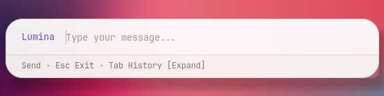

<div align="center">


<br>

<p>


</p>

<p>
<a href="https://github.com/Rafacuy/desklumina/stargazers"></a>
<a href="https://github.com/Rafacuy/desklumina/issues"></a>
<a href="https://github.com/Rafacuy/desklumina/commits"></a>
</p>

<p>
<a href="#get-it-running">Install</a> |
<a href="#pick-a-brain">Pick a provider</a> |
<a href="#give-it-eyes-on-the-web">Web search</a> |
<a href="#say-hello">First run</a> |
<a href="#bind-it-to-a-key">Shortcuts</a> |
<a href="#map-of-the-docs">Docs</a>
</p>

</div>

<br>

> `find my contract folder`
> `what does this song mean?`
> `list files in ~/Documents`
> `close spotify and open the terminal`
>
> Talk to it the way you'd talk to someone standing next to your keyboard. No flags, no man pages, nothing to memorize.

<br>

## So, what is this thing

<table>
<tr>
<td width="35%" align="center">

</td>
<td width="65%">
Say hi to <b>Lumina</b>, the face behind the prompt. She's not an actual chat window, she's just here to give the project a personality instead of another generic terminal icon. 
</td>
</tr>
</table>

DeskLumina sits on your desktop and waits for you to type. Yeah sure, clicking an icon in Plank is faster for opening Spotify, nobody's arguing that. But typing wins the second the task isn't one click away, `find that PDF I downloaded last week`, `close everything except the terminal`, `what's eating my RAM right now`. No dock icon for that. No keyboard shortcut you'll ever remember for that.

***Say it in plain language, it figures out the intent, picks the right tool, and runs it.***

It doesn't ship its own model. Pick a provider, Groq, OpenAI, Anthropic, and a few others, and DeskLumina borrows its brain from there. Most have a free or near-free tier, use it.

<p>

</p>

Local model support is on the [roadmap](docs/roadmap.md). For now, every request travels to whichever provider you pick.

<table>
<tr>
<td width="45%" align="center">

</td>
<td width="55%">

**Bring your own brain, literally.**

Switch providers without touching a single line of code, one `.env` edit and DeskLumina answers to a different brain. 
Groq for speed, Claude for a model that double checks itself, Gemini for the free tier, pick whichever fits the job that day.


</td>
</tr>
</table>

<div align="center">

</div>

## Before you touch the keyboard

If you've never dealt with an "API key" before, here's the short version.

Think of a provider, Groq, OpenAI, Anthropic, whichever one, as a phone company, and an API key as your SIM card. It's what lets your copy of DeskLumina call up their AI and get an answer back. No key, no line to call on. Each provider hands out its own key, usually for free to start, and you paste that key into one settings file so DeskLumina knows who to dial.

You only need **one** key to get going. The rest of this README shows you exactly where to get it, whichever provider you land on.

> [!NOTE]
> An API key looks like a long jumble of letters and numbers, something like `sk-abc123...`. Treat it like a password. Never post it publicly, never commit it to GitHub. If one ever leaks, go back to that provider's dashboard and revoke it, then generate a new one.

## Get it running

<details>
<summary><strong>Got Rofi? That's the screen you'll actually be staring at [MANDATORY]</strong></summary>
<br>

Let's be clear about what Rofi actually is here: it's not a dependency you can shrug off, it's the entire UI. Every prompt, every panel, every menu you'll ever see is Rofi rendering on top of your keystroke. No Rofi, no DeskLumina, just a daemon talking to itself in the dark.

Needs **Rofi 1.7+** at minimum, older builds technically launch but render like garbage. Latest stable is **2.0.0** (Wayland support now ships built-in, no separate fork needed anymore). Check what you've got:

```bash
rofi -v
```

Below 1.7, or nothing printed? Install it:

<br>

<details>
<summary>Arch / Manjaro</summary>

```bash
sudo pacman -S rofi
```

</details>

<details>
<summary>Debian / Ubuntu</summary>

```bash
sudo apt install rofi
```

> **NOTE**: Debian/Ubuntu repos ship old builds. If `rofi -v` still comes back under 1.7 after this, pull a newer one straight from [davatorium/rofi releases](https://github.com/davatorium/rofi/releases).

</details>

<details>
<summary>Fedora</summary>

```bash
sudo dnf install rofi
```

</details>

<details>
<summary>openSUSE</summary>

```bash
sudo zypper install rofi
```

</details>

<br>

> **NOTE**: Running Wayland? As of Rofi 2.0.0, Wayland support is built in natively, no extra package needed. If your distro repo still hands you something older than 2.0.0 without Wayland, build from source via meson, see [davatorium/rofi](https://github.com/davatorium/rofi#building-and-installing) for instructions. 

</details>

<details>
<summary><strong>Have you installed Bun? [MANDATORY]</strong></summary>
<br>

DeskLumina runs on [Bun](https://bun.sh), not Node, that's the runtime actually executing the code once everything's cloned. Type `bun --version` in a terminal, a version number means you're already set, skip straight to step 1.

Nothing printed? One line installs it:

```bash
curl -fsSL https://bun.sh/install | bash
```

Close the terminal and reopen it, or run `source ~/.bashrc` (`~/.zshrc` if the shell is zsh), so the `bun` command gets picked up.

> **NOTE**: Not sure which shell is running? `echo $SHELL` will tell you.

</details>

<details>
<summary><strong>A few system packages too</strong></summary>
<br>

Bun runs the code, but a handful of system packages do the actual work once DeskLumina asks for it:

<table>
<tr>
<th>Package</th>
<th>What it's for</th>
<th>Required?</th>
</tr>
<tr>
<td><code>rofi</code></td>
<td>The entire UI, every panel, prompt, and menu</td>
<td>:white_check_mark: Yes</td>
</tr>
<tr>
<td><code>mpd</code> + <code>mpc</code></td>
<td>Powers the "play a song" command</td>
<td>:white_check_mark: Yes, if you want music control</td>
</tr>
<tr>
<td><code>clipcatctl</code></td>
<td>Clipboard management for agent capabilites</td>
<td>:white_check_mark: Yes, if you want clipboard capabilites</td>
</tr>
</table>

**Note:** `clipcatctl` ships from the [`clipcat`](https://github.com/xrelkd/clipcat) project, not `rofi`/`mpd`. It's only in Arch's official repos, everyone else installs it separately, see below.

<br>
<details>
<summary>Arch / Manjaro</summary>

```bash
sudo pacman -S rofi mpd mpc clipcat
```
</details>

<details>
<summary>Debian / Ubuntu</summary>

```bash
sudo apt install rofi mpd mpc
```
</details>

<details>
<summary>Fedora</summary>

```bash
sudo dnf install rofi mpd mpc
```
</details>

<br>

After installing `mpd`, make sure it's actually running:

```bash
systemctl --user enable --now mpd
```

<details>
<summary><strong>Installing <code>clipcatctl</code> (Debian / Ubuntu / Fedora)</strong></summary>
<br>
`clipcat` (the package that provides `clipcatctl`) isn't in the Debian, Ubuntu, or Fedora repos, Arch is the only one that has it official. Everywhere else, grab a prebuilt release instead of building from source.
 
**Debian / Ubuntu (.deb):**
 
```bash
export CLIPCAT_VERSION=$(basename "$(curl -s -w '%{redirect_url}' https://github.com/xrelkd/clipcat/releases/latest)")
curl -sLO "https://github.com/xrelkd/clipcat/releases/download/${CLIPCAT_VERSION}/clipcat_${CLIPCAT_VERSION#v}_amd64.deb"
sudo dpkg -i "clipcat_${CLIPCAT_VERSION#v}_amd64.deb"
```
 
**Fedora (.rpm):**
 
```bash
export CLIPCAT_VERSION=$(basename "$(curl -s -w '%{redirect_url}' https://github.com/xrelkd/clipcat/releases/latest)")
curl -sLO "https://github.com/xrelkd/clipcat/releases/download/${CLIPCAT_VERSION}/clipcat-${CLIPCAT_VERSION#v}-1.el7.x86_64.rpm"
sudo dnf install --assumeyes "clipcat-${CLIPCAT_VERSION#v}-1.el7.x86_64.rpm"
```
 
**Any distro, from source (needs `cargo`/Rust):**
 
```bash
git clone --branch=main https://github.com/xrelkd/clipcat.git
cd clipcat
cargo install --path clipcatctl
```
 
**Tip:** don't need the daemon or the `clipcat-menu` picker, just the CLI DeskLumina talks to? `cargo install --path clipcatctl` alone is enough, skip the other two binaries.

</details>
</details>

### 1. Clone it into the right spot

```bash
git clone https://github.com/Rafacuy/desklumina.git ~/.config/desklumina
cd ~/.config/desklumina
```

*(no git yet? most Linux distros already ship it, otherwise your package manager has it)*

> [!WARNING]
> DeskLumina has to live at `~/.config/desklumina`. Clone it anywhere else and it won't find its own files.

### 2. Install the dependencies

```bash
bun install
```

### 3. Tell it which brain to use

```bash
cp .env.example .env
```

Open `.env` in any text editor, VS Code, gedit, nano, whatever you have, and fill in one provider key, then set the model:

```env
GROQ_API_KEY=gsk_your_actual_key_here
DESKLUMINA_MODEL=groq:llama-3.3-70b-versatile
```

That's the default and it works well straight out of the box. Every provider and every model option lives in [Configuration](docs/configuration.md), but you don't need that yet, the two lines above are enough to start. If you'd rather pick a different provider first, jump to [Pick a brain](#pick-a-brain) below, there's a short walkthrough for each one.

<details>
<summary><strong>Want a faster launch every time?</strong></summary>
<br>

Compile once, then run the production build instead of rebuilding on every start:

```bash
bun run build
bun run start:prod
```

</details>

<div align="center">

</div>

## Pick a brain

DeskLumina doesn't care which provider you pick, as long as one `_API_KEY` in your `.env` is filled in and unused providers are simply left blank. Below are the six currently supported. Open whichever interests you, each has a short video and a direct link to grab the key.

<details>
<summary><strong>Groq</strong>, fast responses, generous free tier</summary>
<br>

Groq runs open models (Llama, Mixtral, and others) on hardware built specifically for speed. Answers come back quickly, and the free tier covers daily use comfortably.

- Get a key: [console.groq.com/keys](https://console.groq.com/keys)
- Official docs: [console.groq.com/docs](https://console.groq.com/docs)
- Set in `.env`:
```env
  GROQ_API_KEY=
  DESKLUMINA_MODEL=groq:llama-3.3-70b-versatile
```

<a href="https://youtu.be/0cwUGOlWSEw?si=vkIA5fnSUnA_s560"></a>
<sub>Credit: @error-slayer</sub>

</details>

<details>
<summary><strong>OpenRouter</strong>, one key, dozens of models from every lab</summary>
<br>

OpenRouter sits in front of most other providers, so a single key can reach models from OpenAI, Anthropic, Meta, and more. Useful if you want to try different models without collecting five separate keys. Some models listed there cost nothing at all.

- Get a key: [openrouter.ai/keys](https://openrouter.ai/keys)
- Official docs: [openrouter.ai/docs](https://openrouter.ai/docs/quickstart)
- Set in `.env`:
```env
  OPENROUTER_API_KEY=
  DESKLUMINA_MODEL=openrouter:openrouter/free
```
  (swap in any model slug from [openrouter.ai/models](https://openrouter.ai/models))

<a href="https://youtu.be/mrpoGs7sTGk?si=Lb_4fkjTcKHjoVo1"></a>
<sub>Credit: @Thrivemedia0</sub>

</details>

<details>
<summary><strong>OpenAI</strong>, the GPT family, billed from the first token</summary>
<br>

OpenAI's API has no ongoing free tier, you'll need to add a small amount of billing credit before it answers anything. Worth it if you already pay for ChatGPT and want the same models running on your desktop.

- Get a key: [platform.openai.com/api-keys](https://platform.openai.com/api-keys)
- Official docs: [platform.openai.com/docs](https://platform.openai.com/docs)
- Set in `.env`:
```env
  OPENAI_API_KEY=
  DESKLUMINA_MODEL=openai:gpt-5.4-mini
```

<a href="https://youtu.be/qp0t9Wd7TDA?si=p7Igj7s2fRochKgu"></a>
<sub>Credit: @unitedtoptech6288</sub>

</details>

<details>
<summary><strong>Anthropic</strong>, Claude, cautious by design, no free API tier</summary>
<br>

Anthropic makes Claude. Like OpenAI, there's no standing free tier for the API, new accounts usually get a small starter credit and then it becomes pay as you go. Worth picking if you want a model that tends to double check before running anything risky on your machine.

- Get a key: [console.anthropic.com/settings/keys](https://console.anthropic.com/settings/keys)
- Official docs: [docs.claude.com](https://docs.claude.com)
- Set in `.env`:
```env
  ANTHROPIC_API_KEY=
  DESKLUMINA_MODEL=anthropic:claude-haiku-4-5
```

<a href="https://youtu.be/vgncj7MJbVU?si=Lfg-HBS_-IsfQw5Z"></a>
<sub>Credit: @go9x</sub>

</details>

<details>
<summary><strong>Google AI Studio</strong>, Gemini models, a real free tier</summary>
<br>

Google AI Studio is where you generate a key for Gemini. There's a genuine free tier, smaller and rate limited, but enough to try things out without adding a card. One thing that trips people up: the environment variable is `GEMINI_API_KEY`, but the model prefix in `DESKLUMINA_MODEL` is also `gemini`, not `google`.

- Get a key: [aistudio.google.com/app/apikey](https://aistudio.google.com/app/apikey)
- Official docs: [ai.google.dev/gemini-api/docs](https://ai.google.dev/gemini-api/docs)
- Set in `.env`:
```env
  GEMINI_API_KEY=
  DESKLUMINA_MODEL=gemini:gemini-3.5-flash
```

<a href="https://youtu.be/Ra4KObIlXZQ?si=EUpha7zVnFS8PwIJ"></a>
<sub>Credit: @ShaxFinds</sub>

</details>

<details>
<summary><strong>Hugging Face</strong>, open models, a small free allowance</summary>
<br>

Hugging Face hosts inference for a huge range of open weight models. A free account comes with a small amount of monthly credit, enough for light use. A solid option if you want to try a specific open model by name rather than a general purpose assistant.

- Get a token: [huggingface.co/settings/tokens](https://huggingface.co/settings/tokens)
- Official docs: [huggingface.co/docs/api-inference](https://huggingface.co/docs/api-inference/quicktour)
- Set in `.env`:
```env
  HF_API_KEY=
  DESKLUMINA_MODEL=huggingface:meta-llama/Llama-3.3-70B-Instruct
```

<a href="https://youtu.be/f0Cvx-wMLAQ?si=9rgpEex8JQfkAbY7"></a>
<sub>Credit: @IT_explainer</sub>

</details>

One key is all you need to run DeskLumina. If you'd rather have backups ready in case the first provider runs dry or goes down, list a few more in `DESKLUMINA_FALLBACKS`, comma separated, tried in order:

```env
DESKLUMINA_FALLBACKS=groq:llama-3.3-70b-versatile,openrouter/free,anthropic:claude-haiku-4-5,openai:gpt-5.4-mini,huggingface:meta-llama/Llama-3.3-70B-Instruct,gemini:gemini-3.5-flash
```

There's also `DESKLUMINA_EMBED_MODEL`, optional, and only relevant if you're using semantic search or RAG style features. Same `provider:model` format, for example `openai:text-embedding-3-small`.

<div align="center">

</div>

## Give it eyes on the web

Web search is a separate feature and needs its own key. DeskLumina doesn't ship with built in search access, providers charge per query, and giving every install a shared key would get expensive and rate limited within a day. So this part is bring your own.

You can set more than one search key at once. DeskLumina falls back to the next one if a request fails or a limit is hit.

<details>
<summary><strong>Tavily</strong>, built for AI agents, has a free tier</summary>
<br>

- Get a key: [tavily.com](https://tavily.com)
- Docs: [docs.tavily.com](https://docs.tavily.com)
- Set in `.env`: `TAVILY_API_KEY=`

</details>

<details>
<summary><strong>Serper</strong>, fast Google search results, has a free tier</summary>
<br>

- Get a key: [serper.dev](https://serper.dev)
- Docs: [serper.dev](https://serper.dev)
- Set in `.env`: `SERPER_API_KEY=`

</details>

<details>
<summary><strong>SerpApi</strong>, wide search engine coverage, has a free tier</summary>
<br>

- Get a key: [serpapi.com](https://serpapi.com)
- Docs: [serpapi.com/search-api](https://serpapi.com/search-api)
- Set in `.env`: `SERPAPI_API_KEY=`

</details>

<details>
<summary><strong>SearXNG</strong>, self hosted, no key needed if it's your own instance</summary>
<br>

Already running a private SearXNG instance? Point DeskLumina at it directly instead of paying for a commercial key:

```env
SEARXNG_BASE_URL=https://searx.example.com
SEARXNG_AUTH_HEADER_NAME=
SEARXNG_AUTH_HEADER_VALUE=
```

The auth header lines only matter if your instance sits behind one.

- Docs: [docs.searxng.org](https://docs.searxng.org)

</details>

Two more settings round this out, both optional:

```env
# which provider to try first. auto just picks the first one you've configured
DESKLUMINA_WEB_SEARCH_PROVIDER=auto

# how long to wait before giving up, in milliseconds. 2000-20000 is reasonable
DESKLUMINA_WEB_SEARCH_TIMEOUT_MS=8000
```

> [!IMPORTANT]
> Skip this section entirely and DeskLumina still runs fine, it just can't search the web. Any request that needs it will fail with a clear message instead of hanging forever.

<div align="center">

</div>

## Say hello

```bash
bun run start
```

Then just type. A session looks something like this:

<div align="center">

</div>

:+1: Here you go! :shipit:

> [!WARNING]
> A safety layer sits between DeskLumina and your shell. Anything destructive, `rm -rf` and its relatives, gets intercepted and asks for confirmation first. Nothing dangerous runs silently.

<div align="center">

</div>

## Bind it to a key

Typing `bun run start` every single time gets old fast. 
Bind the launch to a shortcut instead, so the Rofi input bar pops up on demand, the same way `rofi -show drun` does.

> [!TIP]
> Compile the production binary once (`bun run build`), then point every shortcut at `start:prod`. Skipping the on-the-fly TypeScript transpile shaves off real time, and it's noticeable on hardware this modest.

<details>
<summary><strong>sxhkd</strong></summary>
<br>

Add a line to `~/.config/sxhkd/sxhkdrc`:

```
super + l
    cd ~/.config/desklumina && $HOME/.bun/bin/bun run start:prod
```

Reload with `pkill -USR1 sxhkd`, or just restart the session. The `cd` matters, DeskLumina expects to be launched from its own folder, and `$HOME/.bun/bin/bun` sidesteps the fact that sxhkd doesn't read your shell's PATH.

</details>

<details>
<summary><strong>XFCE keyboard shortcuts</strong></summary>
<br>

1. Open <kbd>Settings</kbd> → <kbd>Keyboard</kbd>
2. Switch to the **Application Shortcuts** tab
3. Click <kbd>Add</kbd> and paste in:

```bash
bash -c "cd ~/.config/desklumina && $HOME/.bun/bin/bun run start:prod"
```

Assign it to whatever combo isn't already taken, <kbd>Super+l</kbd> is usually free on a stock XFCE install.

</details>

<details>
<summary><strong>i3 / bspwm / other WMs</strong></summary>
<br>

Same idea everywhere, any WM that reads a config file for keybindings works the same way. Drop this into `i3config`, `bspwmrc`, or the equivalent:

```bash
bindsym $mod+l exec --no-startup-id "cd ~/.config/desklumina && $HOME/.bun/bin/bun run start:prod"
```

Swap `bindsym` and `exec` for whatever syntax your WM's config expects, the command itself doesn't change.

</details>

> [!NOTE]
> Haven't compiled yet? `start:prod` fails silently if `bun run build` was never run. Shortcut managers won't show an error either, there's no terminal attached to display one.

## Map of the docs

<table>
<tr>
<td width="55%">

Everything below is written for humans, not linted for a docs generator. 
Open the page that matches what's actually stuck, not the whole stack at once.


</td>
<td width="45%" align="center">

</td>
</tr>
</table>

**Learn how it works**

* [Usage Guide](docs/usage-guide.md) walks through everyday commands.
* [Architecture](docs/architecture.md) covers how a request travels from your keyboard to a finished action.

**Configure it your way**

* [Configuration](docs/configuration.md) lists every environment variable that exists. 
* [Tools Reference](docs/tools-reference.md) documents everything DeskLumina can actually do. 
* [Quick Reference](docs/quick-reference.md) is the cheat sheet version of both.

**Build on top of it**

* [Development](docs/development.md) for setting up a local dev environment. 
* [API Reference](docs/api-reference.md) if you're extending DeskLumina itself. 
* [Roadmap](docs/roadmap.md) for what's planned next.

**When something breaks**

* [Troubleshooting](docs/troubleshooting.md) for the errors people actually hit. 
* [Security](docs/security.md) for how keys, confirmations, and the safety layer work underneath.

<br><br>

MIT License · <a href="LICENSE">LICENSE</a>


</div>

