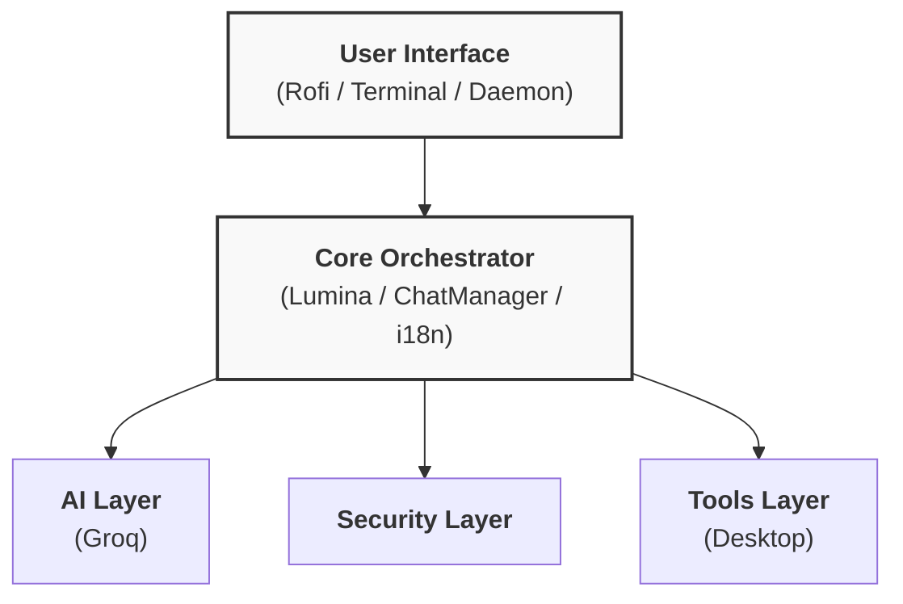

# 05 - Architecture

Understand the internal design, module organization, and data flow of DeskLumina.

---

## Table of Contents

- [System Overview](#system-overview)
- [Module Map](#module-map)
- [Core Components](#core-components)
  - [Lumina (Orchestrator)](#lumina-orchestrator)
  - [ChatManager](#chatmanager)
  - [Tool Registry](#tool-registry)
- [Data Flow](#data-flow)
- [Security Model](#security-model)
- [UI Layer](#ui-layer)

---

## System Overview

DeskLumina is designed with a modular architecture that separates concern between UI, Intelligence (AI), and System Execution (Tools).

---

## Module Map

The project is organized into several key directories under `src/`:

- **`ai/`**: Handles all AI interactions (Groq streaming, TTS generation, prompts).
- **`config/`**: Environment variable loading (`env.ts`) and application aliases (`apps.json`).
- **`constants/`**: Shared constants (command timeouts, model defaults, API endpoint).
- **`core/`**: The "brain" of the application (Lumina orchestrator, Chat/Settings managers).
- **`tools/`**: Desktop automation implementations (apps, files, media, terminal).
- **`ui/`**: User interface components (Rofi logic, themes, loading animations).
- **`daemon/`**: Background service implementation.
- **`security/`**: Confirmation dialogs and dangerous command analysis.
- **`logger/`**: File and console logging infrastructure.
- **`types/`**: TypeScript type definitions and default settings.
- **`utils/`**: Shared helpers (formatters, i18n, path utilities).
- **`locales/`**: JSON translation files for English and Indonesian.

---

## Core Components

### Lumina (Orchestrator)
**Path**: `src/core/lumina.ts`  
The central hub that coordinates all activity. It takes user input, manages the AI conversation context, dispatches tool calls, and returns formatted responses to the UI.

### ChatManager
**Path**: `src/core/chat-manager.ts`  
Handles conversation persistence. It saves chat history to `~/.config/desklumina/chats/` and manages session state, including tool call results.

### Tool Registry
**Path**: `src/tools/registry.ts`  
A central mapping of tool names (like `app`, `file`, `terminal`) to their TypeScript implementations. This allows for easy extensibility—adding a new tool simply requires registering it here.

---

## Data Flow

1.  **Input Capture**: User types a command in Rofi or Terminal.
2.  **Context Building**: `Lumina` builds the request from `system prompt + bounded prior context + current user message`.
3.  **AI Request**: The input and context are sent to the Groq API.
4.  **Streaming**: AI starts streaming text and tool calls back to DeskLumina.
5.  **Tool Execution**:
    - `Planner` parses tool call JSON.
    - `Security` checks for dangerous commands.
    - `Registry` dispatches to the correct tool handler and records structured result data (`success`, `stderr`, `exitCode`, normalized args).
6.  **Retry Loop**: Failed tool calls are fed back into the model as structured tool-result context. Lumina retries corrected tool calls up to 2 times.
7.  **Persistence**: Assistant text and tool-result messages are saved into chat history. Older turns are compacted into summaries to bound context growth.
8.  **Final Output**: Tool results may be displayed in the UI; the assistant text is displayed and can be spoken via TTS.

## BREAKING CHANGES

- `app` no longer treats unknown aliases as shell commands. Use the `terminal` tool for arbitrary commands.
- `file` no longer falls back to arbitrary shell execution. Unsupported file actions now fail explicitly.
- Tool outcomes are now persisted as first-class chat messages and replayed into future model context.

---

## Security Model

DeskLumina implements a **Human-in-the-Loop** security model.

- **Passive Analysis**: All terminal commands are scanned for dangerous patterns (e.g., `rm -rf /`).
- **Active Confirmation**: If a command is deemed high-risk, a Rofi confirmation dialog is shown.
- **Path Restrictions**: Tools like `file` prevent operations on sensitive system directories without elevated permissions or explicit confirmation.

---

## UI Layer

DeskLumina's UI is designed to be "invisible until needed."

- **Rofi Integration**: Uses Rofi's `dmenu` and `script` modes to create a dynamic chat interface.
- **Theming**: Powered by `.rasi` files, allowing for deep customization of colors, fonts, and layouts.
- **Asynchronous Feedback**: A background loader animation is shown during AI inference to keep the UI responsive.

---

## Next Steps

- 🔧 **[Tools Reference](07-tools-reference.md)** — Learn about the available tools.
- ⚙️ **[Configuration](04-configuration.md)** — Fine-tune the architecture.
- 🛠️ **[Development Guide](10-development.md)** — Learn how to extend the system.

---

[← Configuration](04-configuration.md) | [Usage Guide →](06-usage-guide.md)
