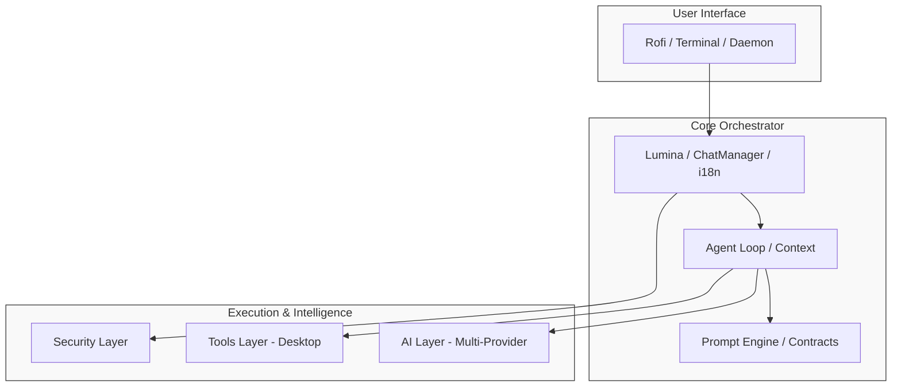
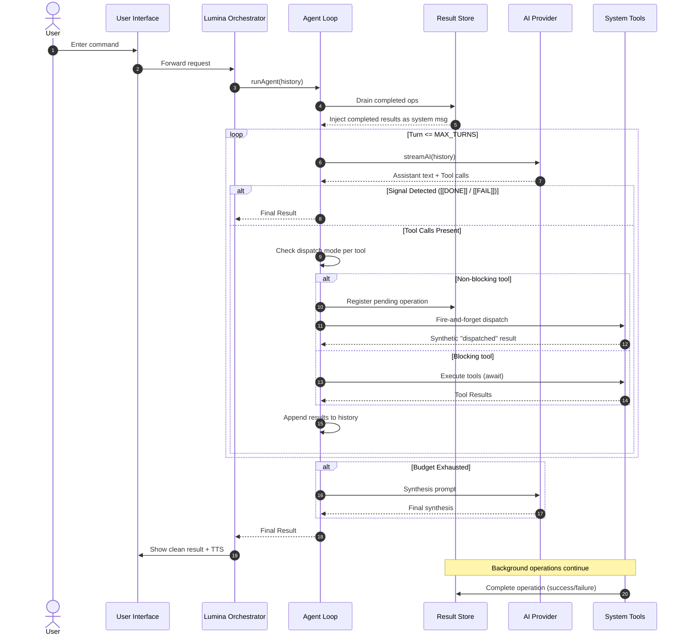

# 05 - Architecture

Understand the internal design, module organization, and prompt architecture of DeskLumina.

---

## Table of Contents

- [System Overview](#system-overview)
- [Module Map](#module-map)
- [Intelligence Layer (AI)](#intelligence-layer-ai)
  - [Multi-Provider Orchestration](#multi-provider-orchestration)
  - [Fallback & Resilience Strategy](#fallback--resilience-strategy)
  - [Token Management & Middleware](#token-management--middleware)
- [Agentic Workflow](#agentic-workflow)
  - [Agent (ReAct Loop)](#agent-react-loop)
  - [Bounded Reasoning Loop](#bounded-reasoning-loop)
- [Core Components](#core-components)
  - [Lumina (Orchestrator)](#lumina-orchestrator)
  - [Contract-Driven Prompts](#contract-driven-prompts)
  - [Live Context Injection](#live-context-injection)
  - [Long-term Memory](#long-term-memory-ltm)
- [Data Flow](#data-flow)
- [Security Model](#security-model)
- [UI Layer](#ui-layer)

---

## System Overview

DeskLumina is designed with a modular architecture that separates concerns between the UI, Intelligence (AI), and System Execution (Tools).

---

## Module Map

The project is organized into several key directories under `src/`:

- **`agent/`**: The core of the agentic workflow. Implements the bounded ReAct reasoning loop, terminal signal parsing, turn-based context accumulation, history trimming, and background operation context injection.
- **`ai/`**: Handles AI interactions through a multi-provider architecture. Includes provider adapters (Groq, OpenAI, Anthropic, Gemini, OpenRouter, Hugging Face), a shared streaming base, SSE parsing, model resolution with fallback chains, circuit-breaker health tracking, and the contract-driven prompt builder.
- **`bin/`**: Binary utilities and helper scripts.
- **`config/`**: Environment variable loading and application aliases.
- **`constants/`**: Shared constants such as command timeouts, model defaults, and tool retries.
- **`core/`**: High-level orchestration, containing the Lumina coordinator, Chat/Settings managers (with provider preference storage), and the tool planner.
- **`daemon/`**: Background service implementation. Manages the Unix domain socket, token-based authentication, cache warming, and file watching for instant command response.
- **`launcher/`**: Entry point routing. Dispatches CLI flags (`--chat`, `--exec`, `--send`, `--daemon-status`, `--version`, `provider`) to the appropriate mode (Rofi, terminal, daemon client, or exec).
- **`ltm/`**: Long-term memory subsystem (SQLite persistence, async extraction, embedding generation, semantic episodic retrieval, prompt formatting).
- **`tools/`**: Desktop automation implementations (apps, files, music, etc.) and their formal contracts. Includes the result store for background operation tracking, dispatch mode configuration, and the terminal command classifier.
- **`tts/`**: Text-to-speech pipeline. Includes the adaptive chunker, natural voice disfluency planner, and latency masking.
- **`ui/`**: User interface components including Rofi logic, themes, and tool result rendering.
- **`security/`**: Confirmation dialogs and dangerous command analysis.
- **`logger/`**: File and console logging infrastructure.
- **`types/`**: TypeScript type definitions for tools, results, and AI messages.
- **`utils/`**: Shared helpers such as formatters, i18n, and path utilities.

---

## Intelligence Layer (AI)

DeskLumina features a robust, multi-provider intelligence layer designed for high availability and reliability.

### Multi-Provider Orchestration
**Path**: `src/ai/runtime/orchestrator.ts`
The orchestrator manages the lifecycle of an AI request across multiple providers. It uses a **provider-agnostic model resolution** system that allows fallback chains to span different platforms (e.g., failing over from Groq to OpenAI).

### Fallback & Resilience Strategy
1.  **Model Resolution**: The system expands configured models and aliases (like `fast` or `smart`) into a prioritized list of `{ providerId, modelId }`.
2.  **Circuit Breaking**: The `CircuitBreaker` (`src/ai/providers/circuit-breaker.ts`) tracks the health of each provider. If a provider consistently fails (e.g., returns 5xx or 429), it is temporarily marked as "unhealthy" and skipped in the fallback chain.
3.  **Automatic Failover**: When a primary model fails with a retriable error (Rate Limit, Server Error, or Model Not Found), the orchestrator immediately moves to the next model in the resolved list, regardless of whether it belongs to the same provider.
4.  **Health Recovery**: Providers are automatically re-tested after a cooldown period to restore them to the active pool once they become responsive.

### Token Management & Middleware
- **Global Token Counter**: Tracks usage across all providers to enforce safe limits and provide metrics.
- **Middleware Pipeline**: Requests pass through a pipeline for capability guarding (ensuring the model supports requested features), logging, and token counting before reaching the provider.

---

## Agentic Workflow

### Agent (ReAct Loop)
**Path**: `src/agent/agent.ts`
The Agent implements a **Bounded ReAct Loop**. Each iteration involves reasoning, tool selection, and execution. The loop is bounded by a turn budget (default: 10) to prevent infinite loops and manage token consumption.

### Bounded Reasoning Loop
DeskLumina uses a turn-based reasoning loop to solve complex tasks:
1.  **Reasoning**: The model analyzes the conversation history and decides the next step.
2.  **Action**: The model emits tool calls if needed.
3.  **Execution**: System executes tools and injects results back into history as `user` messages.
4.  **Signal Detection**: The system scans for terminal markers (`[[DONE]]`, `[[FAIL]]`).
5.  **History Trimming**: If history exceeds the token limit, early reasoning turns are discarded to preserve recent context.
6.  **Synthesis Fallback**: If the turn budget is exhausted, the system forces a final answer without further tool use.

### Non-Blocking Tool Dispatch

DeskLumina supports fire-and-forget execution for tools whose results are not needed immediately (e.g., launching GUI apps, sending notifications, or running background commands).

**Path**: `src/tools/registry/modes.ts`, `src/tools/result-store.ts`

1.  **Dispatch Modes**: Each tool declares a default mode (`blocking` or `non-blocking`) in `TOOL_MODES`. The `terminal` tool is hybrid; each command is classified at runtime.
2.  **Result Store**: A singleton (`resultStore`) tracks `PendingOperation` and `CompletedOperation` records in memory. Background operations register as pending, then move to completed on resolution.
3.  **Context Injection**: At the start of each agent turn, `runAgent()` drains completed operations from the result store and injects them as system messages. Pending operations are also injected so the model knows what is still running.

### Terminal Command Classification

**Path**: `src/tools/frameworks/terminal-classify.ts`

The terminal tool classifies each command before execution:

| Mode | Trigger | Behavior |
|------|---------|----------|
| `non-blocking` | Known GUI app (e.g., `firefox`, `code`) or `&`-suffixed command | Spawns detached, returns immediately |
| `blocking` | Default for CLI commands | Captures stdout/stderr/exitCode with timeout |
| `rejected` | Empty command or interactive `ssh` without remote command | Returns error, does not execute |

The classifier also rewrites interactive installer commands (`apt install`, `pacman -S`, etc.) to include non-interactive flags (`-y`, `--noconfirm`).

---

## Core Components

### Lumina (Orchestrator)
**Path**: `src/core/lumina.ts`
The central hub coordinates activity between the UI and the Agent. It prepares the initial context, triggers the agent loop, and handles terminal signals. It also manages the final presentation, including i18n-aware failure messaging and TTS.

### Contract-Driven Prompts
**Path**: `src/ai/runtime/prompts.ts`
DeskLumina generates prompts dynamically from **Tool Contracts** (`src/tools/contracts/contracts.ts`). Each contract defines:
- **Schema & Types**: Formal syntax for tool calls.
- **Valid/Invalid Formats**: Examples that ground the model's output.
- **Failure Behavior**: Specific retry limits and retriable vs. non-retriable errors.
- **Path/Quoting Rules**: Precise constraints for argument formatting.

### Persona Injection

The prompt builder (`src/ai/runtime/prompts.ts`) supports runtime persona injection. When a non-default persona is selected in settings, the persona's compact prompt string is appended to the assistant identity section of the system prompt. The default persona uses the identity directly with no appended text. Invalid persona identifiers fall back safely to the default.

### Live Context Injection
DeskLumina injects real-time system state into every request:
- **Probing**: Uses `pactl` and `xdotool` to gather volume and active window info.
- **Caching**: Probes are cached for 30 seconds to minimize system overhead.
- **Media Context**: Media state is queried on-demand via the `music` tool (using `{"current": true}`) rather than injected into every prompt.

### Long-Term Memory (LTM)

- **Storage**: LTM is persisted in SQLite (`bun:sqlite`) within `memories`.
- **Episodic Embeddings**: Episodic rows include `embedding` as JSON text.
- **Migration**: On startup, LTM applies a safe schema migration (`ALTER TABLE ... ADD COLUMN embedding TEXT`) when needed, preserving all existing rows.
- **Embedding Model Selection**: Embedding generation uses `ltm.embedModel` (or its fallbacks), **not** `ltm.model`. The chat model and the embedding model are deliberately decoupled. Resolution order:
  1. `settings.ltm.embedModel` (bare id → uses `ltm.provider`; `provider:model` → overrides it)
  2. `DESKLUMINA_EMBED_MODEL` env var
  3. `models.json` `primary.embedModel`
  4. Legacy: reuse `ltm.model` if its provider supports embeddings
  5. Walk main provider chain (`DESKLUMINA_MODEL` + `DESKLUMINA_FALLBACKS`) and pick first embedding-capable provider
   6. `null` (pipeline degrades gracefully)
- **Provider Capability**: Each provider declares `embeddingsSupported` in its capability map. `openai`, `gemini`, and `huggingface` are `true`; `anthropic`, `groq`, and `openrouter` are `false`. Providers that don't support embeddings throw a clear error if `embed()` is called, rather than silently returning garbage.
- **Extraction Path**: After assistant response delivery, extraction runs asynchronously using `ltm.model` (chat) for fact extraction and the resolved embedding provider (above) for vectorization.
- **Failure Handling**: If embedding generation fails (network, capability, or missing key), episodic text is still stored with `embedding = NULL`, and retrieval falls back to lexical FTS search.
- **Retrieval Path**:
  1. Generate query embedding via the resolved embedding provider.
  2. Load episodic rows and embeddings.
  3. Parse/validate vectors.
  4. Score with cosine similarity in TypeScript.
  5. Filter by configurable threshold.
  6. Sort and keep configurable top-K.
- **Compatibility**: No FAISS/HNSW/native extensions; semantic scoring is in-memory and Bun-native.

---

## Data Flow

---

## Security Model

DeskLumina implements a **Human-in-the-Loop** security model.

- **Passive Analysis**: All terminal commands are scanned for dangerous patterns (e.g., recursive deletion, nested command substitution).
- **Active Confirmation**: High-risk commands trigger a Rofi confirmation dialog.
- **Path Restrictions**: The `file` tool enforces specific rules for absolute paths and tilde expansion, preventing directory traversal.

---

## UI Layer

- **Rofi Integration**: Uses Rofi's `dmenu` mode for a lightweight, floating chat interface.
- **Theming**: Powered by `.rasi` files, allowing for deep customization.
- **Tool Display**: `src/ui/tool-display.ts` renders tool results into human-readable tables and lists within the chat. Terminal signals are hidden from the user-facing UI to maintain a clean experience.

---

## Next Steps

- 🔧 **[Tools Reference](07-tools-reference.md)**: Learn about the available tools and their contracts.
- ⚙️ **[Configuration](04-configuration.md)**: Fine-tune the architecture.
- 🛠️ **[Development Guide](10-development.md)**: Learn how to extend the system.

---

[← Configuration](04-configuration.md) | [Usage Guide →](06-usage-guide.md)
