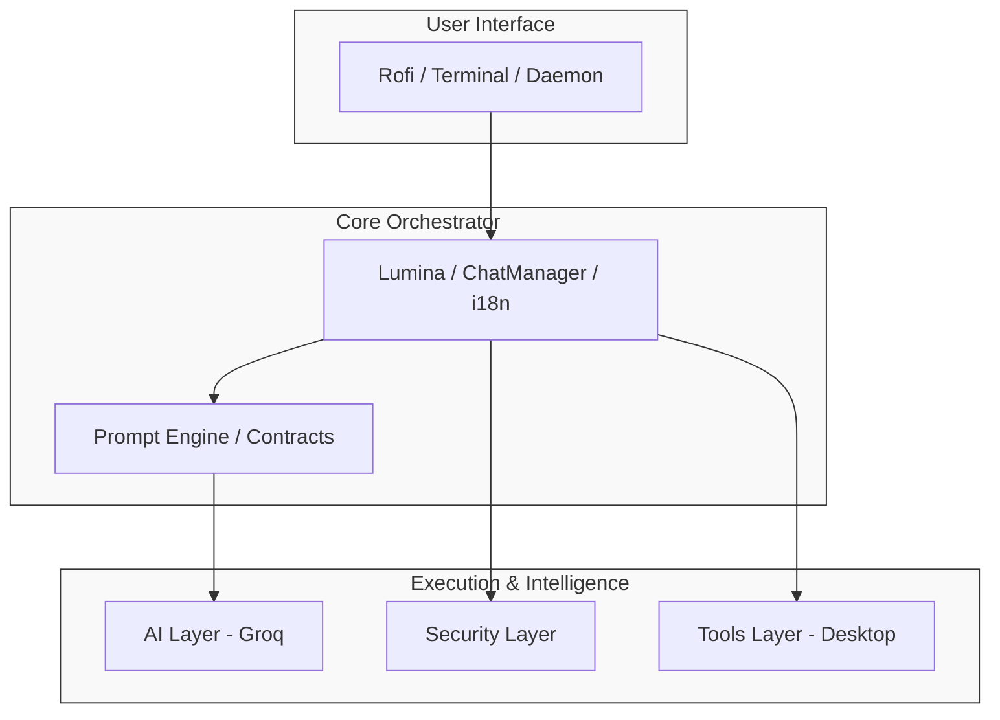
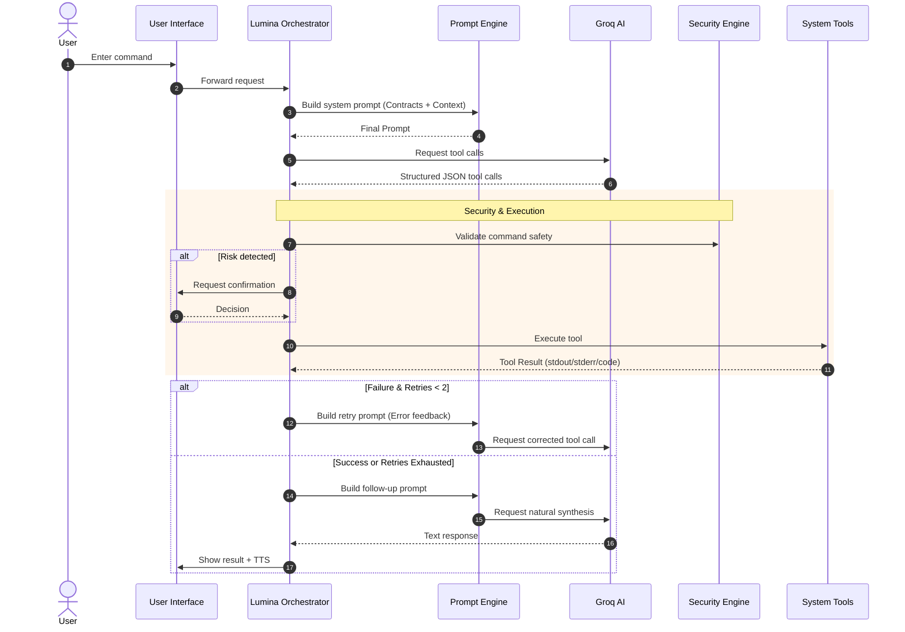

# 05 - Architecture

Understand the internal design, module organization, and prompt architecture of DeskLumina.

---

## Table of Contents

- [System Overview](#system-overview)
- [Module Map](#module-map)
- [Core Components](#core-components)
  - [Lumina (Orchestrator)](#lumina-orchestrator)
  - [Contract-Driven Prompts](#contract-driven-prompts)
  - [Tool Registry](#tool-registry)
- [Data Flow](#data-flow)
- [Failure Escalation Tree](#failure-escalation-tree)
- [Security Model](#security-model)
- [UI Layer](#ui-layer)

---

## System Overview

DeskLumina is designed with a modular architecture that separates concerns between the UI, Intelligence (AI), and System Execution (Tools).

---

## Module Map

The project is organized into several key directories under `src/`:

- **`ai/`**: Handles AI interactions, including Groq streaming, TTS generation, and the contract-driven prompt builder.
- **`config/`**: Environment variable loading and application aliases.
- **`constants/`**: Shared constants such as command timeouts, model defaults, and tool retries.
- **`core/`**: The brain of the application, containing the Lumina orchestrator, Chat/Settings managers, and the tool planner.
- **`tools/`**: Desktop automation implementations (apps, files, music, etc.) and their formal contracts.
- **`ui/`**: User interface components including Rofi logic, themes, and tool result rendering.
- **`security/`**: Confirmation dialogs and dangerous command analysis.
- **`logger/`**: File and console logging infrastructure.
- **`types/`**: TypeScript type definitions for tools, results, and AI messages.
- **`utils/`**: Shared helpers such as formatters, i18n, and path utilities.

---

## Core Components

### Lumina (Orchestrator)
**Path**: `src/core/lumina.ts`  
The central hub coordinates all activity. It takes user input, builds deterministic system prompts, manages the tool execution lifecycle (including retries), and synthesizes final responses.

### Contract-Driven Prompts
**Path**: `src/ai/prompts.ts`  
Instead of static text, DeskLumina generates prompts dynamically from **Tool Contracts** (`src/tools/contracts.ts`). Each contract defines:
- **Schema & Types**: Formal syntax for tool calls.
- **Valid/Invalid Formats**: Examples that ground the model's output.
- **Failure Behavior**: Specific retry limits and retriable vs. non-retriable errors.
- **Path/Quoting Rules**: Precise constraints for argument formatting.

### Live Context Injection
DeskLumina injects real-time system state into every request:
- **Probing**: Uses `pactl`, `playerctl`, and `xdotool` to gather volume, media state, and active window info.
- **Caching**: Probes are cached for 30 seconds to minimize system overhead.
- **Selective Injection**: A relevance filter (`selectContext`) ensures only pertinent state (e.g., media state for music queries) is sent to the model, saving tokens.

---

## Failure Escalation Tree

DeskLumina implements a 3-stage escalation logic for tool failures:

1.  **Failure 1 (Correction)**: Lumina identifies syntax or path errors from the tool's `stderr`. It feeds the error back to the model, which corrects the arguments and retries.
2.  **Failure 2 (Verification)**: If a corrected call still fails, the system verifies the tool contract and local file system state. The model is instructed to avoid repeating the same failing arguments.
3.  **Failure 3 (Escalation)**: After 2 unsuccessful retries, execution stops. The system synthesizes a structured failure report explaining the blockers to the user.

---

## Data Flow

---

## Security Model

DeskLumina implements a **Human-in-the-Loop** security model.

- **Passive Analysis**: All terminal commands are scanned for dangerous patterns (e.g., recursive deletion, nested command substitution).
- **Active Confirmation**: High-risk commands trigger a Rofi confirmation dialog.
- **Path Restrictions**: The `file` tool enforces specific rules for absolute paths and tilde expansion, preventing directory traversal.

---

## UI Layer

- **Rofi Integration**: Uses Rofi's `dmenu` mode for a lightweight, floating chat interface.
- **Theming**: Powered by `.rasi` files, allowing for deep customization.
- **Tool Display**: `src/ui/tool-display.ts` renders tool results (especially complex file search results) into human-readable tables and lists within the chat.

---

## Next Steps

- 🔧 **[Tools Reference](07-tools-reference.md)**: Learn about the available tools and their contracts.
- ⚙️ **[Configuration](04-configuration.md)**: Fine-tune the architecture.
- 🛠️ **[Development Guide](10-development.md)**: Learn how to extend the system.

---

[← Configuration](04-configuration.md) | [Usage Guide →](06-usage-guide.md)
