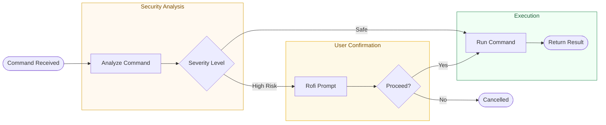

# 09 - Security

How DeskLumina protects your system while providing powerful automation.

---

## Table of Contents

- [Security Philosophy](#security-philosophy)
- [Dangerous Command Detection](#dangerous-command-detection)
- [Confirmation System](#confirmation-system)
- [Path Restrictions](#path-restrictions)
- [Timeout Protection](#timeout-protection)

---

## Security Philosophy

DeskLumina follows a **Human-in-the-Loop** (HITL) security model. While AI is capable, users should always have the final say on actions that could result in data loss or system instability.

1.  **Transparency**: Users should always know what a tool is about to do.
2.  **Consent**: Destructive actions require explicit user approval.
3.  **Safety Defaults**: DeskLumina is configured with conservative security settings by default.

---

## Dangerous Command Detection

Every command passed to the **Terminal** or **File** tools is scanned by a rule-based analyzer before execution. DeskLumina uses consistent word boundary enforcement to ensure dangerous commands are detected even when they are not at the beginning of a command string.

**Logic**: `src/security/dangerous-commands.ts`

### Embedded Command Detection

The security engine does not rely on simple prefix matching. It scans the entire command string for dangerous patterns. For example, a command like `ls; rm -rf /` will trigger a **Critical** severity warning because the recursive deletion is detected even though it follows a safe command.

### Severity Levels:

| Level | Definition | Action |
|-------|------------|--------|
| **Safe** | Read-only or standard operations (e.g., `ls`, `free`). | Execute immediately. |
| **Medium** | Potentially destructive or system-impacting (e.g., `cp`, `npm install`). | **Require confirmation.** |
| **High** | More destructive operations (e.g., `rm`, `mv`, `chmod`). | **Require confirmation.** |
| **Critical** | High risk of data loss or system failure (e.g., `rm -rf`, `sudo`). | **Require confirmation.** |

### Command Substitution Protection

DeskLumina explicitly detects and blocks nested command execution within terminal strings. Patterns for command substitution and process substitution are classified as **Critical** risks. This prevents bypass attacks where a dangerous command is hidden inside an otherwise safe-looking command.

---

## Confirmation System

When a command is flagged as **High** or **Critical** severity, DeskLumina pauses execution and prompts the user for confirmation.

**Logic**: `src/security/confirmation.ts`

- **Rofi Dialog**: A specialized Rofi window appears with the full command and a "Yes/No" prompt.

---

## Path Restrictions (File Tool)

The **File** tool implements its own internal restrictions to prevent accidental modification of system-critical files.

**Logic**: `src/tools/frameworks/file-shared.ts` (`DANGEROUS_PATHS`, used by `isDangerousPath`)

### Protected Directories:
- `/`, `/bin`, `/boot`, `/dev`, `/etc`, `/lib`, `/proc`, `/root`, `/run`, `/sbin`, `/sys`, `/usr`, `/var`

Any operation targeting these paths (or anything underneath them) will trigger a Rofi confirmation before execution, even if the command itself is not inherently flagged by the terminal analyzer. The `delete` operation additionally refuses to remove `/` or the user's `$HOME` outright, returning an "Invalid file request" error.

---

## Timeout Protection

To prevent runaway processes or hung tools from freezing your desktop:

- **Terminal Timeout**: All shell commands have a default **30-second timeout**. If a command takes longer, it is forcefully killed.

---

## Next Steps

- 🤖 **[Daemon Mode](11-daemon-mode.md)**: Security in background services.
- ⚙️ **[Configuration](04-configuration.md)**: Adjusting security levels.
- 🧪 **[Testing Guide](12-testing.md)**: Verifying security rules.

---

[← API Reference](08-api-reference.md) | [Development Guide →](10-development.md)
