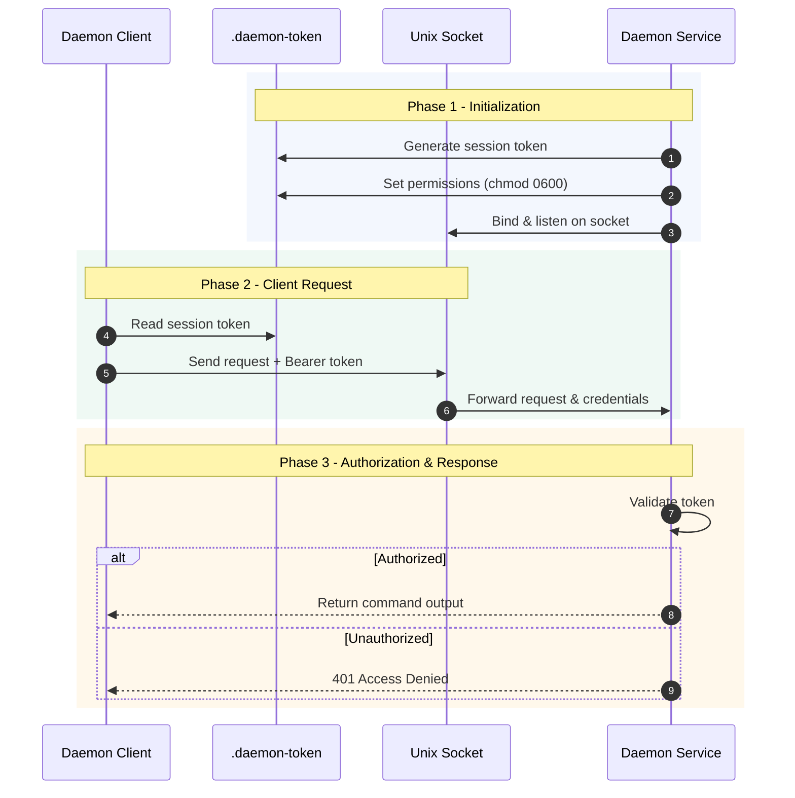

# 11 - Daemon Mode

Optimize DeskLumina for instant response times with persistent background execution.

---

## Table of Contents

- [Introduction](#introduction)
- [Why Daemon Mode?](#why-daemon-mode)
- [Security & Authentication](#security--authentication)
- [Quick Start](#quick-start)
- [Systemd User Service](#systemd-user-service)
- [Advanced Integration (sxhkd)](#advanced-integration-sxhkd)
- [Troubleshooting](#troubleshooting)

---

## Introduction

Daemon mode runs DeskLumina as a persistent background process. The daemon stays active and listens for incoming commands over a **Unix Domain Socket** at `$XDG_RUNTIME_DIR/desklumina.sock` (falls back to `~/.config/desklumina/desklumina.sock` if `XDG_RUNTIME_DIR` is not set).

---

## Why Daemon Mode?

- **Zero Overhead**: Avoids starting a new Bun process for every command.
- **Stable Endpoint**: Provides a persistent socket for hotkeys and scripts.
- **Structured Data**: The daemon returns full execution metadata, including tool results and file matches.
- **Background Operations**: Non-blocking tools (app launches, GUI commands) continue running after the daemon responds. Results are tracked by the result store and injected into context on the next request.

---

## Security & Authentication

To prevent unauthorized access from other local processes, the daemon implements a token-based authentication system.



1.  **Token Generation**: A unique session token is generated when the daemon starts and saved to `~/.config/desklumina/.daemon-token` with restricted permissions.
2.  **Authorization**: All requests sent to the daemon socket must include this token in the `Authorization` header as a `Bearer` token.
3.  **Client Handling**: The `DaemonClient` automatically retrieves this token from the configuration directory before sending commands.

---

## Quick Start

### 1. Start the Daemon
```bash
# Start in the foreground
bun run daemon

# Start in the background
bun run daemon:start
```

### 2. Check Daemon Status
```bash
bun run daemon:status
```

### 3. Send a Command
Once the daemon is running, use the `send` command to interact with it:
```bash
bun run send "open telegram"
bun run send "what's the current volume?"
```

---

## Systemd User Service

Automate DeskLumina's startup with the provided service file: `systemd/desklumina-daemon.service`.

1.  **Verify Bun path**: The service file uses `/usr/bin/bun`. If your Bun lives elsewhere, update `ExecStart` accordingly. 
    ```bash
    which bun
    ```
2.  **Install the Service**:
    ```bash
    cp systemd/desklumina-daemon.service ~/.config/systemd/user/
    systemctl --user daemon-reload
    systemctl --user enable --now desklumina-daemon.service
    ```
4.  **Manage Service**:
    - `systemctl --user status desklumina-daemon.service`
    - `systemctl --user restart desklumina-daemon.service`

---

## Troubleshooting

- **Socket Already in Use**: If the daemon crashes, the socket file might remain. The system performs an automated health check. If the socket is stale, it is automatically removed and refreshed.
- **Connection Refused**: Ensure the daemon is running with `bun run daemon:status`.
- **Logs**: Check `~/.config/desklumina/logs/general.log` and `~/.config/desklumina/logs/error.log`.
- **Abandoned Background Operations**: On daemon shutdown, any pending background operations are logged as warnings and cleared. These operations will not complete; if you need a long-running command to survive daemon restarts, run it directly in a terminal.

---

## Next Steps

- ⚙️ **[Configuration](04-configuration.md)**: Customizing daemon behavior.
- 🧪 **[Testing](12-testing.md)**: Verifying socket communication.
- 🏁 **[Back to Introduction](01-introduction.md)**

---

[← Development Guide](10-development.md) | [Testing →](12-testing.md)
